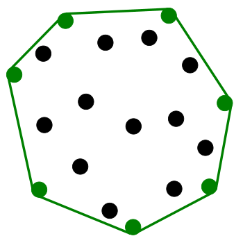
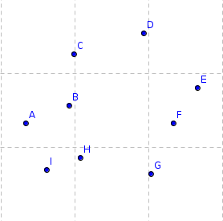
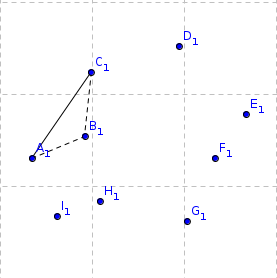
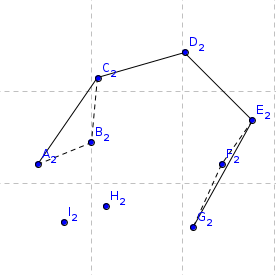
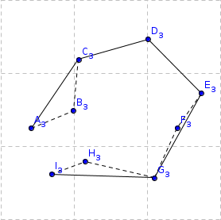
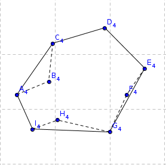
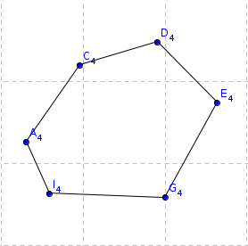
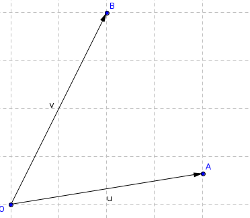
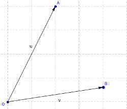

<%= tex_set("show_numbers_in_sections", false); %>

Convex hull is a classical problem in computational geometry and often used in programming contests. Today I present to you  the Andrew's algorithm to compute the convex hull from a set of 2D points. 

## Convex Hull

Here a definition from Robert Sedgewick lecture notes.

A set of point is <strong>convex</strong> if for any two points <em>p</em> and <em>q</em> is the set, the line segment <em>pq</em> is completely in the set.

  

<strong>Convex hull</strong>. Smallest convex set containing all the points.

## Andrew's algorithm

The Andrews's Algorithm splits the convex hull in two parts parts, upper hull and lower hull, here the algorithm.

<ol>
  <li>L and U are lists of points.</li>
  <li>Sort the set of point by x coordinate in ascending order.</li>
  <li>Construct the upper hull:</li>
  <ol>
    <li>start from the point with smallest x coordinate, if two points has equal x coordinate take the one with the largest y coordinate.</li>
    <li>Taking the point with the largest y coordinate may cause the hull to become concave, so, check if the current point and the last two in U form a convex triangle, if not, remove the last point in U and try again with the last two, an so on till a convex triangle is found.</li>
    <li>Add the current pont to U</li>
  </ol>
  <li>Construct the lower hull:</li>
  <ol>
    <li>start from the point with largest x coordinate, if two points has equal x coordinate take the one with the smallest y coordinate.</li>
    <li>Taking the point with the smallest y coordinate may cause the hull to become concave, so, check if the current point and the last two in L form a convex triangle, if not, remove the last point in L and try again with the last two, an so on till a convex triangle is found.</li>
    <li>Add the current pont to L</li>
  </ol>
  <li>Join the upper and the lower convex hull.</li>
</ol>

<table>
<tr>
<td>
<td>
</tr>
<tr>
<td>
<td>
</tr>
<tr>
<td>
<td>
</tr>
</table>

## Sample problem

A easy problem where you can put in practice this topic is with <a href="http://lightoj.com/volume_showproblem.php?problem=1203" target="_blank">1203 - Guarding Bananas</a> from <a href="http://lightoj.com/" target="_blank">lightoj.com</a>.

To check if three point are convex you can use a vector cross product.

<table>
<tr>
<td>
<td>
</tr>
</table>

If points A, O and B are in clockwise orientation then $ v \times u$ will be greater than zero, otherwise the result will be less than  zero.

## Solution to sample problem

Apply the algorithm to find the convex hull and then, for each point that form the convex hull, compute the angle between it and its left and right points, take the minimum.

Embed: `sol.cpp`

## References
<table border="0">
  <tr><td>1</td> <td><a href="http://community.topcoder.com/tc?module=Static&d1=tutorials&d2=lineSweep" target="_blank">Line Sweep Algorithms, bmerry</a></td></tr>
  <tr><td>2</td> <td><a href="http://www.cs.princeton.edu/courses/archive/fall05/cos226/lectures/geometry.pdf" target="_blank">Geometry Lecture, Robert Sedgewick</a></td></tr>
</table>
