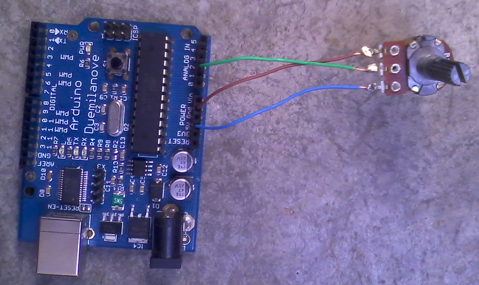

<%= tex_set("show_numbers_in_sections", false); %>

Today I will show you how to build a simple volume controller using arduino and serial communication in GNU/Linux, specifically Debian Squeeze.

Arduino provides their own tool for serial communication but isn't practical for most applications because isn't customizable, although for debugging is well.  Due to a college project I am studying about serial programming in order to establish communication with arduino from a program written in C. So far I am able to send and to retrieve data to and from arduino(duemilanove) and the first thing that came to my mind was to make a volume controller for my speakers :-). I hope you find it interesting!

## Materials

<ul>
  <li>1 Arduino(tested with Duemilanove)</li>
  <li>1 potentiometer</li>
  <li>Wires</li>
  <li>C compilers and ncurses libraries, in debian: `apt-get install gcc libncurses5-dev`</li>
</ul>

## Let's get started

As first step, build the following circuit: 

Use the following code for arduino to read the input from the potentiometer.

Embed: `read-input.cpp`

This program reads the value that we indicate with the potentiometer(a value from 0 to 1023), then transform this value to a scale from 0 to 100, the volume of the speakers.

In the next program we establish serial communication with arduino, reads the appropiate values and and then, adjust the volume of the speakers using `amixer`.

Embed: `volume.c`

Connect the USB cable from arduino to the computer and execute the previous program and we get:

<iframe width="640" height="360" src="http://www.youtube.com/embed/YxS-DS1nLBs?feature=player_detailpage" frameborder="0" allowfullscreen></iframe>

<iframe width="640" height="360" src="http://www.youtube.com/embed/MBYaRwM9fFo?feature=player_detailpage" frameborder="0" allowfullscreen></iframe>

That is all friends! See you in the next post.

## References

<table>
  <tr> <td>1</td> <td><a href="http://en.wikibooks.org/wiki/Serial_Programming/Serial_Linux" target="_blank">Serial Programming/Serial Linux</a></td> </tr>
  <tr> <td>2</td> <td><a href="http://www.arduino.cc/en/Tutorial/Potentiometer" target="_blank">Reading a Potentiometer (analog input)</a></td> </tr>
</table>
