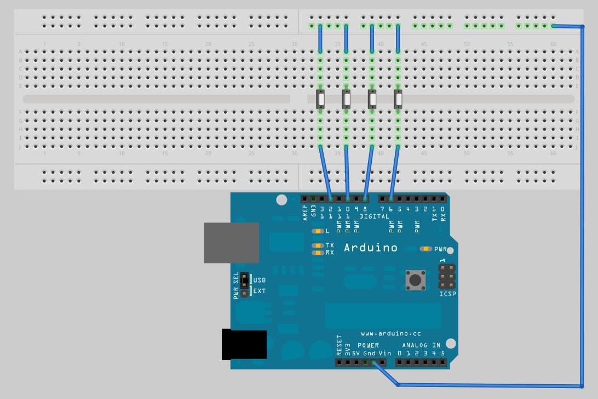
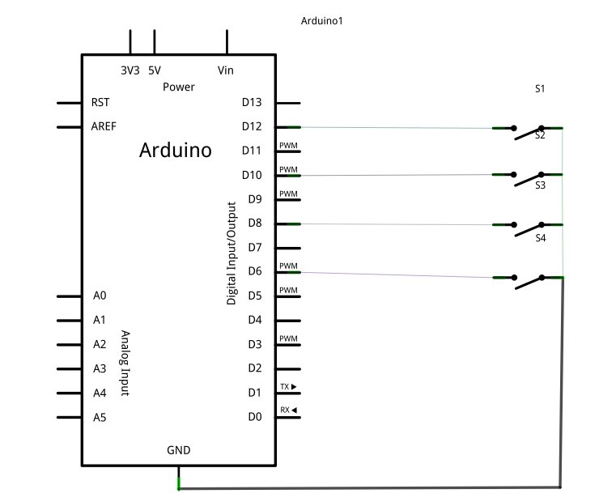

<% tex_set("show_numbers_in_sections", false); %>

Hi guys!, In my [previous post](/arduino-control-speakers) I described how to build a volume controller with Arduino, using the <strong>termios</strong> API for serial communication in GNU/Linux, well, in this post I use the same concepts to build a simple game controller for the classical game Snake.

## Let's get started

We need to build the following circuit:

We need the following code in <em>wiring</em> to receive instructions from the board.  

Embed: `read-instructions.cpp`

The previous code reads the button presses and write the appropriate values to the serial channel, we'll read this values from our game. I have implemented a limited version of the game Snake for our purpose, here is the code:

Embed: `snake.cpp`

Connect the Arduino to the PC and execute the previous program. Here is a screenshot of the game in action.

Game Over! See you in the next post.

## References

The schematic and the electronic diagram were designed using <a href="http://fritzing.org/" target="_blank">fritzing</a>.

<table>
  <tr> <td>1</td> <td><a href="http://en.wikibooks.org/wiki/Serial_Programming/Serial_Linux" target="_blank">Serial Programming/Serial Linux</a></td> </tr>
  <tr> <td>2</td> <td><a href="http://www.arduino.cc/en/Tutorial/Potentiometer" target="_blank">Reading a Potentiometer (analog input)</a></td> </tr>
</table>
