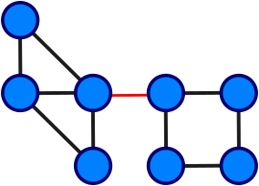

# Bridge edges
Let's talk a little bit about <%= link_to('https://en.wikipedia.org/wiki/Bridge_%28graph_theory%29', 'bridges', target: :blank) %>, like in graph theory. In a nutshell, an edge is called a bridge if its removal increases the number of connected components. In a connected graph, if I were to remove a bridge, it would not be connected anymore, see <%= ref('bridge_edge') %>.

## Problem
The problem is <%= link_to('http://lightoj.com/volume_showproblem.php?problem=1026', '1026 - Critical Links', target: :blank) %>, it's literally finding bridge edges, it's a good problem to test your implementation before solving problems where this algorithm is just a part of the solution.

## Solution
Next is my implementation in C++:

Embed: `sol.cpp`

I hope it helps, in the references you can find more detailed explanations of the algorithm.

## References
- [Bridges in a graph](http://www.geeksforgeeks.org/bridge-in-a-graph/)
- [Bridge (graph theory)](https://en.wikipedia.org/wiki/Bridge_(graph_theory))

<%= generate_bib_table(:en) %>
