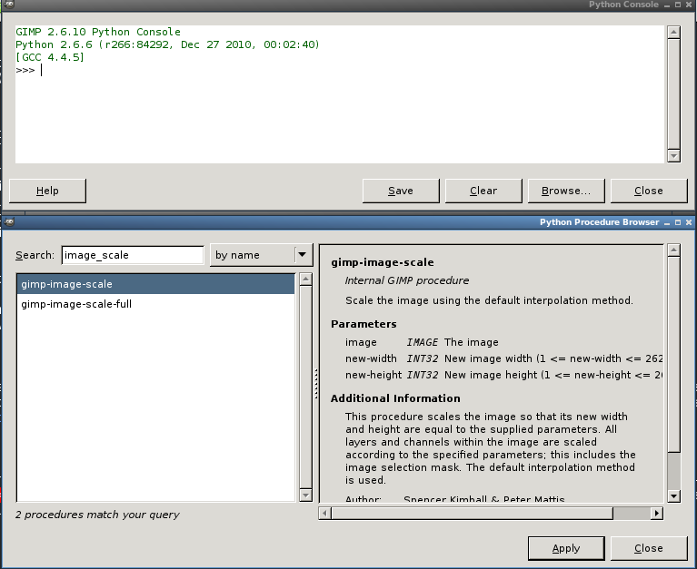

## Problema

En estos días he estado trabajando en un proyecto web junto con algunos compañeros de clase y estoy contento porque he aprendido muchas cosas interesantes, hoy les voy a hablar de una de ellas.

Estamos desarrollando un sitio web para un centro comercial y empleamos muchas imágenes para los distintos productos que se ofertan. Cada uno de los integrantes se encargo de recolectar información de los productos de las distintas secciones, y el problema empezó cuando cada quien recolecto fotos de distintos tamaños y fue necesario redimensionar y decorar cada una de las imágenes a un tamaño adecuado(150x150). Tiempo atrás ya había oído hablar que se podían emplear scripts con gimp para automatizar la edición de imágenes, así que me puse a investigar.

Gimp soporta scripts en <a href="http://www.gimp.org/docs/python/index.html" target="_blank">python</a> y en <a href="http://www.gimp.org/tutorials/Basic_Scheme/" target="_blank">scheme</a>, de los cuales he optado por python. A continuación el código que emplee para resolver mi problema. 

Embed: `script.py`

En este ejemplo mis imágenes están en formato JPEG pero ustedes pueden modificarlo para adaptarlo a sus necesidades. En la línea 2 importamos todo el contenido del modulo `gimpfu` el cual contiene todo lo necesario para trabajar con gimp, `os` y `re` son de utilería.

Desde una consola nos trasladamos al directorio donde están las imágenes y ejecutamos gimp. Vamos a Filters `-&gt;`Python-Fu`-&gt;`Console</code>, tenemos dos opciones, teclear el código ahí directamente o lo guardamos en un archivo y lo ejecutamos en el interprete con la función `execfile('script.py')`.

La documentación de las funciones que empleo en el script y muchas más la proporciona el mismo gimp y podemos acceder a ella con el botón `Browse...`. Hasta aquí con este post, espero que esta información les sea tan útil como a mi o más.

## Referencias

- [1] <a href="http://www.gimp.org/docs/python/index.html" target="_blank">GIMP Python Documentation</a> 
- [2] <a href="http://www.gimp.org/tutorials/Basic_Scheme/" target="_blank">Basic Scheme</a</a>>

