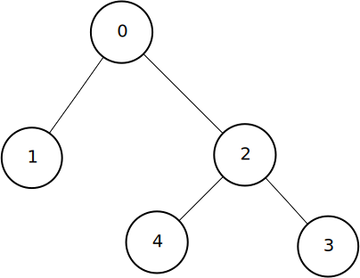

<a href="http://en.wikipedia.org/wiki/Breadth-first_search">Breadth-First Search</a> is another fundamental algorithm in <a href="http://en.wikipedia.org/wiki/Graph_theory" target="_blank">graph theory</a>, it's a must to know!.

For this algorithm we need a <a href="http://en.wikipedia.org/wiki/Queue_%28abstract_data_type%29" target="_blank">queue</a>.

Embed: `src.cpp`

Example input(figure <%= ref('graph') %>):

Embed: `input.txt`

Example output:

Embed: `output.txt`

And that's it. Remember, Breadth-First Search must be part of your toolbox!

