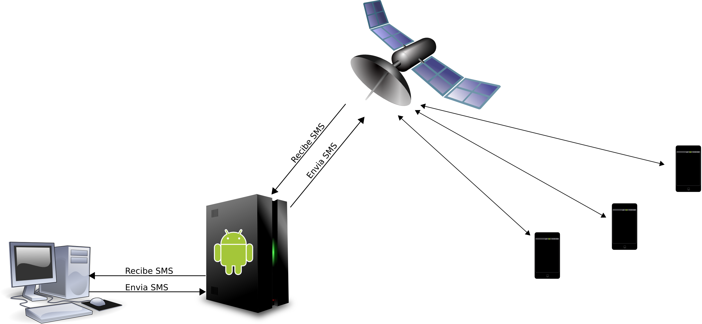
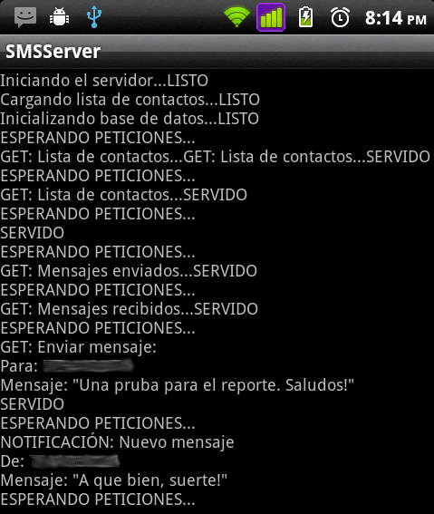
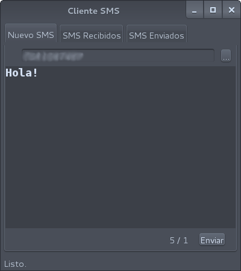
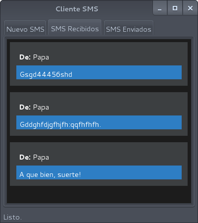
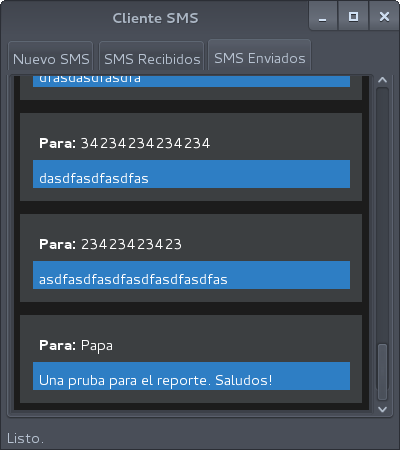
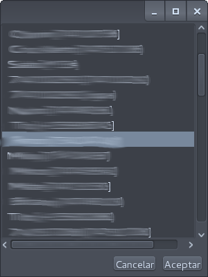

¡Hola! Con éste documento doy inicio a una serie de reportes correspondientes al desarrollo de los proyectos de la asignatura <strong>Desarrollo de Aplicaciones para Tecnologías Móviles</strong>.

## Definición del problema

En esta ocasión toca el turno al primer proyecto, que podríamos denominar "Envío de mensajes SMS desde la PC". A continuación una breve descripción.

<blockquote>Desarrollar una aplicación de escritorio que permita a sus usuarios enviar y recibir mensajes de texto (SMS) desde la PC, usando un dispositivo celular o smartphone que funja como emisor y receptor.</blockquote>

## Propuesta de solución

La solución que vamos a tratar en este reporte consiste en lo siguiente. No vamos a crear 1 programa sino 2, un servidor en el dispositivo móvil y un cliente en la PC. El siguiente diagrama puede ayudar a entender mejor la solución.

### Servidor

Se encargará de las siguientes actividades:

<ul>
  <li>Enviar los mensajes que el cliente le solicite y almacenarlos en una base de datos.</li>
  <li>Recibir los mensajes entrantes y almacenarlos en la base de datos.</li>
  <li>Servir la libreta de contactos del dispositivo móvil.</li>
  <li>Servir la lista de mensajes enviados.</li>
  <li>Servir la lista de mensajes recibidos.</li>
  <li>Resolver si existe un nuevo mensaje.</li>
  <li>Servir el último mensaje recibido.</li>
</li>

### Cliente

Éste se comunicará con el servidor y proporcionará una interfaz gráfica al usuario con los siguientes servicios.

<ul>
  <li>Enviar mensaje SMS.</li>
  <li>Mostrar la lista de contactos.</li>
  <li>Visualizar los mensajes recibidos.</li>
  <li>Actualizar la bandeja de entrada cuando lleguen nuevos mensajes.</li>
  <li>Visualizar los mensajes enviados.</li>
</ul>

## Requisitos

Para poder seguir este tutorial necesitas contar con los siguientes requisitos:

<ul>
  <li>Un dispositivo móvil con sistema operativo Android 2.3 (probablemente funcione con versiones posteriores)</li>
  <li>[El SDK de Java configurado](/setup-jdk).</li>
  <li>[El SDK de Android configurado](/setup-android-sdk).</li>
  <li>Opcional: IntelliJ IDEA 12 Comunity Edition, `http://www.jetbrains.com/idea/`.</li>
  <li>Conocimientos intermedios de Java.</li>
  <li>Un sistema operativo GNU/Linux Debian, utilizaremos la versión 7, denominada Wheezy.</li>
</ul>

### Notas

<ul>
  <li>Es necesario aclarar que no vamos a explicar los programas línea por línea, sino más bien, una explicación de las partes más importantes que les ayude a comprenderlos, en caso de necesitar una explicación más detallada pueden consultar las referencias que se proporcionan al final del documento.</li>
  <li>Acostumbro codificar en Ingles puesto que considero es más homogéneo, permite exponer mi código a una audiencia más amplia, y me ayuda a mejorar mi comprensión del idioma. Aunque por ser un trabajo para la escuela la interfaz forzosamente tiene que ser en Español.</li>
</ul>

## El servidor

El servidor es una aplicación para Android. Es un servidor HTTP que recibe peticiones mediante el método GET, quizás no lo más adecuado pero si lo más sencillo. Para no empezar desde cero vamos a hacer uso de NanoHTTPD (_http://nanohttpd.com/_), que como su nombre lo indica es un servidor HTTP muy pequeño, ideal para un sistema embebido.

Con el fin de aprender a utilizar el SDK de Android he optado por no utilizar un IDE para esta parte, únicamente las herramientas que incluye el SDK y la línea de comandos, nada de que preocuparse. 

### Crear el proyecto

En la línea de comandos teclee los siguiente:

Embed: `create-project.sh`

Así debe lucir la estructura del proyecto:

Embed: `project-structure.txt`

Por el momento en el archivo _SMSServer.java_ hay solo un método, _onCreate()_, que lo único que hace es imprimir un mensaje en de bienvenida. Primero veamos cómo implementar el servidor, dentro del archivo _SMSServer.java_ creamos una clase privada _HelloServer_ que herede de _NanoHTTPD_, un constructor y  el método _serve()_, es éste último es donde se concentra la mayor parte de la acción. El código es bastante simple por lo que no creo que halla necesidad de entrar mucho detalle.

Embed: `hello-server.java`

La forma de enviar datos con el método GET tiene el siguiente formato:

Embed: `get-format.txt`

Un signo de interrogación seguido por una lista de parámetros con formato clave=valor, separados por ampersands (&). NanoHTTPD se encarga de extraer dichos parámetros y se los pasa al método _serve()_ en la variable _parameters_, el cliente siempre enviará como primer parámetro la cadena "command" y su valor va a determinar la acción que el cliente esta solicitando. Los posibles comandos son:

<ul>
  <li><strong>COMMAND_GET_CONTACTS</strong> para solicitar la lista de contactos.</li>
  <li><strong>COMMAND_SEND_MESSAGE</strong> para enviar un mensaje.</li>
  <li><strong>COMMAND_GET_SENT_MESSAGES</strong> para solicitar todos los mensajes enviados.</li>
  <li><strong>COMMAND_GET_RECEIVED_MESSAGES</strong> para solicitar todos los mensajes recibidos.</li>
  <li><strong>COMMAND_CHECK_FOR_NEW_MESSAGE</strong> para preguntar al servidor si hay un mensaje nuevo.</li>
  <li><strong>COMMAND_GET_LAST_MESSAGE</strong> para recuperar el nuevo nuevo mensaje en caso de haberlo.</li>
</ul>

Todas éstas constantes se definen tanto en el cliente como en el servidor. 

### Agregando acción al método onCreate()

Éste método es el primero que se ejecuta al iniciar la aplicación y en el vamos a incluir algunas acciones, como son, iniciar el servidor, recuperar la lista de contactos del dispositivo y cargar la base de datos. En caso de que la base de datos no exista ésta deberá ser creada, las bases de datos SQLite se almacenan en archivos. 

Embed: `on-create.java`

### Servir la lista de contactos

En el método _onCreate()_ cargamos la libreta de contactos en _contactList_, ésta lista es la que le enviaremos al cliente cuando la solicite.

Embed: `get-contacts.java`

### Servir la lista de mensajes enviados

Embed: `get-received-messages.java`

### Enviar SMS

El método _sendSMS()_ es el que se encarga de enviar los mensajes SMS:

Embed: `send-sms.java`

### Detectar los mensajes entrantes

Esta es una de las partes más interesantes. Cada vez que sucede un evento el sistema hace notificaciones todas la aplicaciones que así lo requieran, para ser notificados es necesario heredar la clase _BroadcastReceiver_.

Embed: `sms-receiver.java`

Y en el método _onResume()_ de la clase SMSServer:

Embed: `on-resume.java`

### La base de datos

Para que el registro de mensajes enviados y recibidos persista incluso después de reiniciar el servidor es necesario almacenar dichos mensajes en algún lugar, en este caso, una base de datos, Android provee soporte nativo para SQLite. La clase _DBManager se encarga de todas las operaciones de la base de datos.

Embed: `db-manager.java`

### Concesión de permisos

En Android las aplicaciones por defecto cuentan con privilegios muy limitados, por lo cual es necesario conceder permisos para poder acceder al Internet, a los mensajes, a los contactos, etc. Estos permisos se especifican en el archivo _AndroidManifest.xml_ que se encuentra en folder raíz del proyecto.

Embed: `permissions.xml`

Hasta aquí la descripción del programa, veamos ahora la compilación e instalación. 

Nos posicionamos en el folder de nuestro proyecto y tecleamos lo siguiente, la primera línea es para compilar y la segunda para instalar la aplicación en el dispositivo o en el emulador, lo que encuentre primero.

Embed: `compile-and-install.sh`

La dirección del servidor es la dirección IP que tienen el dispositivo móvil, en el puerto 8080, por ejemplo, _http://192.168.1.242:8080_. Esta dirección la tienen que conocer el cliente para poder conectarse.

## El cliente

El cliente es una programa en Java, con una interfaz sencilla, una venta principal con tres pestañas, la primera para enviar mensajes, la segunda para visualizar los mensajes recibidos y la última para visualizar los mensajes enviados. Para esta parte utilice el IDE IntelliJ IDEA.

Además de la interfaz gráfica se ha desarrollado una clase _SmsClient_ que se encargará de obtener los recursos del servidor. A continuación se describen los métodos.

### testConnection()

Intenta conectar al servidor y retorna verdadero en caso de éxito.

Embed: `test-connection.java`

### getSentMessages()

Obtiene del servidor la lista de mensajes enviados.

Embed: `get-sent-messages.java`

### getReceivedMessages()

Recupera del servidor la lista de mensajes enviados.

Embed: `client-get-received-messages.java`

### getContactList()

Obtiene del servidor la lista de contactos en el dispositivo.

Embed: `get-contact-list.java`

### sendSMS()

Solicita al servidor enviar un mensaje, enviándole como parámetros el número y el mensaje.

Embed: `client-send-sms.java`

### NewMessagePanel

Hacemos unas cuantas validaciones y en caso satisfactorio procedemos a enviar el mensaje.

Embed: `action-performed.java`

### InboxPanel

Esta parte si es un poco interesante, cómo saber si ha llegado un nuevo mensaje y  en su caso obtenerlo y actualizar el contenido de la bandeja de entrada. Para eso creamos una clase que se ejecuta en un hilo independiente y continuamente pregunta al servidor si hay mensajes nuevos.

Embed: `sms-monitor.java`

### SentMessagePanel

Esta parte es más simple, únicamente muestra la lista de mensajes enviados. En caso de no poder contactar al servidor al momento de iniciar la aplicación, ésta se mantiene continuamente reintentado, lo mismo pasa con las otras partes de la aplicación.

Embed: `run.java`

### Bono

Al enviar un mensaje el usuario puede introducir el número directamente o presionar el botón con etiqueta "..." para acceder a la lista de contactos del dispositivo. Por cuestiones de seguridad he alterado la imagen puesto que es mi lista de contactos.

El código es sencillo:

Embed: `contact-chooser.java`

Hasta aquí las explicaciones, espero les sea de utilidad.

## Código fuente

Tanto el servidor como el cliente se encuentran hospedados en Bitbucket, bajo la licencia GPLv3, con excepcón de NanoHTTPD, el cual tienen su propia licencia. Para obtenerlo puedes ir directamente a los siguientes sitios y descargar un archivo ZIP.

<ul>
  <li><strong>SMSServer:</strong> <a href="https://bitbucket.org/rendon/smsserver">https://bitbucket.org/rendon/smsserver</a></li>
  <li><strong>SMSClient:</strong> <a href="https://bitbucket.org/rendon/smsclient">https://bitbucket.org/rendon/smsclient</a></li>
</ul>

O bien puedes clonar el proyecto usando el Sistema de Control de Versiones <strong>git</strong>.

Embed: `clone-projects.sh`

## Conclusión

Este primer proyecto fue interesante puesto que me permitió recordar algunas cosas y aprender muchas más, por ejemplo, cómo crear aplicaciones en Android, entiendo mejor la forma en que trabajan los servidores, entre otras cosas.

Los programas en realidad no son tan complicados, con un poco de investigación y análisis estoy seguro de que lograrán entenderlos.

## Por hacer

En esta sección vamos a listar algunas características que en nuestra aplicación no se implementaron pero que la harían mejor.

<ul>
  <li>Cambiar el método de comunicación con el servidor de <strong>GET</strong> a <strong>POST</strong>, éste último es más seguro.</li>
  <li>Actualmente la aplicación de escritorio tiene que estar verificando constantemente la llegada de nuevos mensajes, lo más adecuado sería que el smartphone notifique a la aplicación de escritorio en cuándo arribe  un nuevo SMS.</li>
  <li>Implementar un método de autenticación para que no cualquiera pueda enviar mensajes.</li>
</ul>

## Referencias

<% 
- [Documentación de Android](https://developer.android.com/index.html)
- [Begining Android Application Development](http://www.wrox.com/WileyCDA/WroxTitle/Beginning-Android-Application-Development.productCd-1118087291.html)
- [Documentación de NanoHTTPD](http://nanohttpd.org/)
%>
