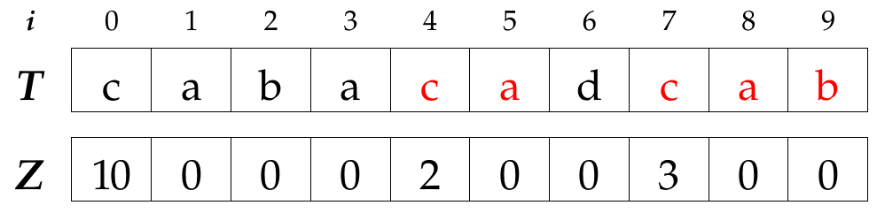

String matching is a very common problem, given a text $T$ and a pattern $P$ find the occurrences of $P$ in $T$. This problem doesn't need too much introduction.

The most easy (and naive) algorithm to solve this problem is to slide off $P$ through $T$ and see if there is a match. Something like this:

Embed: `naive-search.cpp`

However, much more efficient solutions exists to this problem, the Z algorithm is one of them.

<h2>The $Z_{i}(T)$ function</h2>

  The $Z_{i}(T)$ is equal to the length of the longest substring starting at position $i > 0$ that matches a prefix of $T$.

 

For example, let be T = "cabacadcab", $Z_{3} = 0$, $Z_{4} = 2$ and $Z_{7} = 3$. Obviously $Z_{0}$ is always equal to the length of the string. See figure <%= ref('fig_z_alg_example') %>.

## Z Boxes

    If $Z_{i} > 0$ a Z-box is a substring that starts at position $i$ and ends at position $i + Z_{i} - 1$, i.e. the substring that matches the prefix of $T$.

Assume that we have already computed the values of $Z$ upto some $k-1$ and now we need to compute $Z_{k}$. There are four possible cases. In the following pictures $l$ and $r$ denote de start and the end of the last Z-box.

### Case 1: $ k $ is out of the last Z-box

Position $k$ is not contained in the last Z-box. We need to compare character by character to find $Z_{k}$.

### Case 2: $ k $ is within the last Z-box

We'll denote this last Z-box as $\alpha$ and as $\beta$ the box starting at position $k$ and ending at $r$. Since every Z-box matches a prefix, the figure <%=ref('fig_z_alg_case_2');%> depicts our situation.

As you can see, $k'$ corresponds to position $k$ in the prefix and we already computed $Z_{k'}$ and so we can leverage this fact. There are three more cases.

#### Case 2a: $ Z_{k'} < |\\beta| $

In this case $Z_{k} = Z_{k'}$.

#### Case 2b: $ Z_{k'} > |\\beta| $

Let be $x$ the first character that is not contained in the last Z-box and $y$ the first character that is not contained in the prefix, we know one thing, $x \neq y$ and therefore $Z_{k}$ cannot be greater than $Z_{k'}$. Result $Z_{k} = |\beta|$.

#### Case 2c: $ Z_{k'} = |\beta| $

Here we know two things, $x \neq y$  and $y \neq w$. How about $x$ and $w$? We don't know, they may be equal or not. In this case it's necessary to verify.

Okay, here is an implementation to complement the explanation:

Embed: `implementation.cpp`

Since $l$ and $r$ never decrease the complexity of this algorithm is $O(n)$.

## String matching using the Z function

Now that we know how to compute the Z function let's see how to use it to find the occurrences of a pattern $P$ in a text $T$. The idea is easy:

<ol>
  <li>Concatenate $P$ with $T$ and compute the Z function in the resulting string ($S$ = $P$ + $T$ )</li>
  <li>There is an occurrence of $P$ that start at position $i >= |P|$ if  $Z_{i}(S) >= |P|$.</li>
</ol>

<h2>Practice problems</h2>

Here are some problems to put into practice this algorithm:

<ul>
  <li><a href="http://codeforces.com/contest/432/problem/D" target="_blank">Codeforces Round #246 Div 2 Problem D: Prefixes and Suffixes</a> | <a href="https://gist.github.com/rendon/0cd66d5891b5758cd382" target="_blank">My solution</a></li>
  <li><a href="http://lightoj.com/volume_showproblem.php?problem=1255" target="_blank">Light OJ: 1255 - Substring Frequency</a> | <a href="https://gist.github.com/rendon/43bbc8f3fbcb8d231c99" target="_blank">My solution</a></li>
</ul>

## References

- [Linear-time pattern matching. Z-values and Z-algorithm](http://www.cs.ucdavis.edu/~gusfield/cs122f10/videolist.html)
